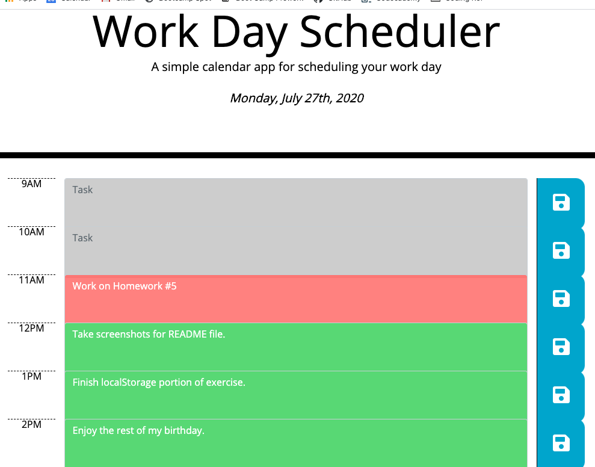

## Homework 05 Third-Party APIs: Work Day Scheduler

Create a simple calendar application that allows the user to save events for each hour of the day. This app will run in the browser and feature dynamically updated HTML and CSS powered by jQuery.

### Parameters of the Assignment

A daily calendar with the following:
- Current date in the header.
- Time blocks for work day schedule with text areas and save buttons per hour.
- Background shading designating past, present or future time block.
- Task entered saves to local storage and persists when navigated away from page and/or is refreshed.

### Screenshot of Application

### Links
- [Workday Scheduler](https://bwaycarl.github.io/workday-scheduler/)
- [Github Repository](https://github.com/BwayCarl/workday-scheduler)
